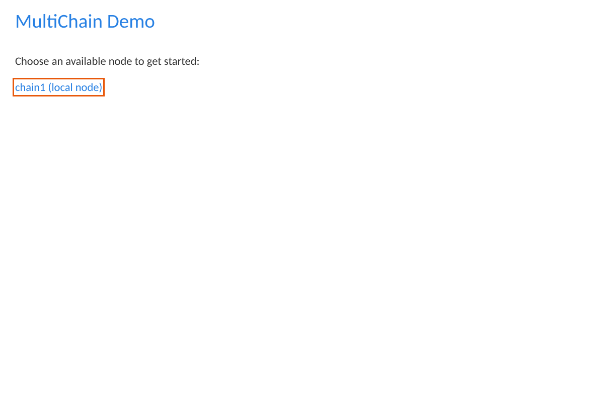
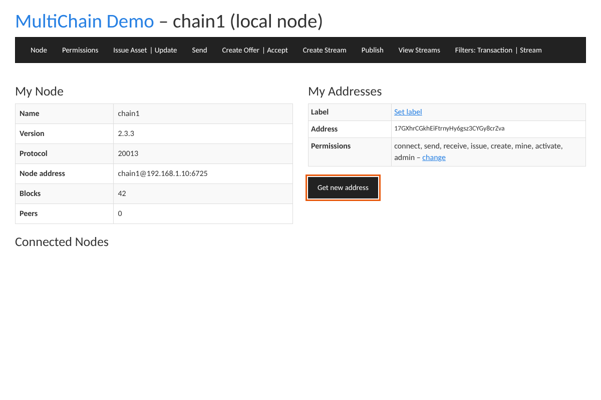
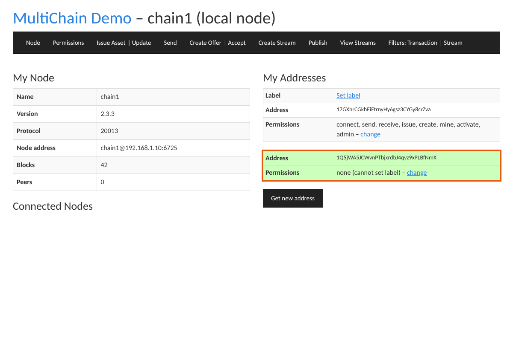
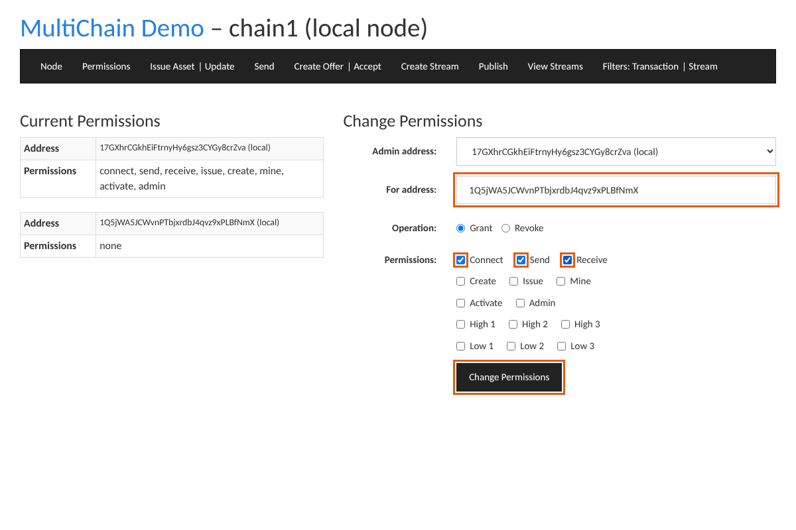
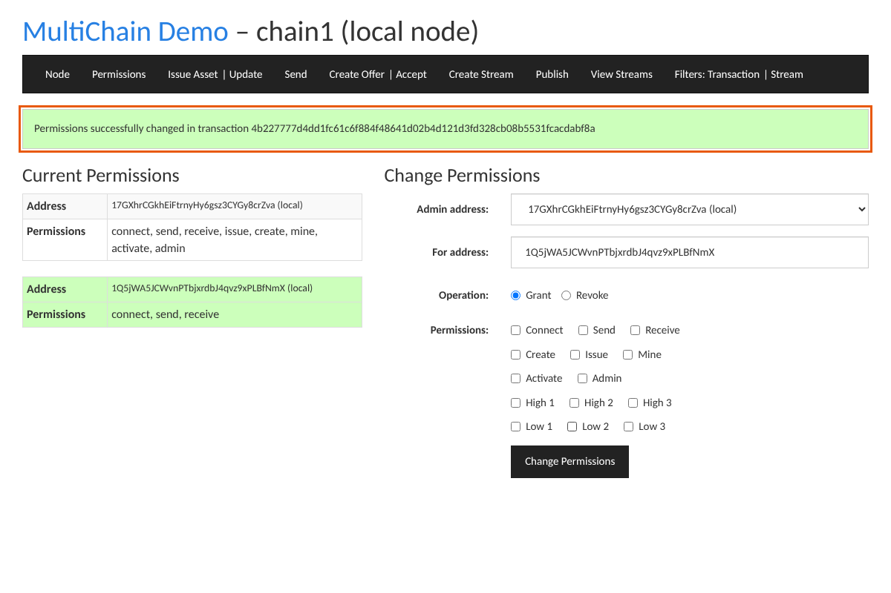
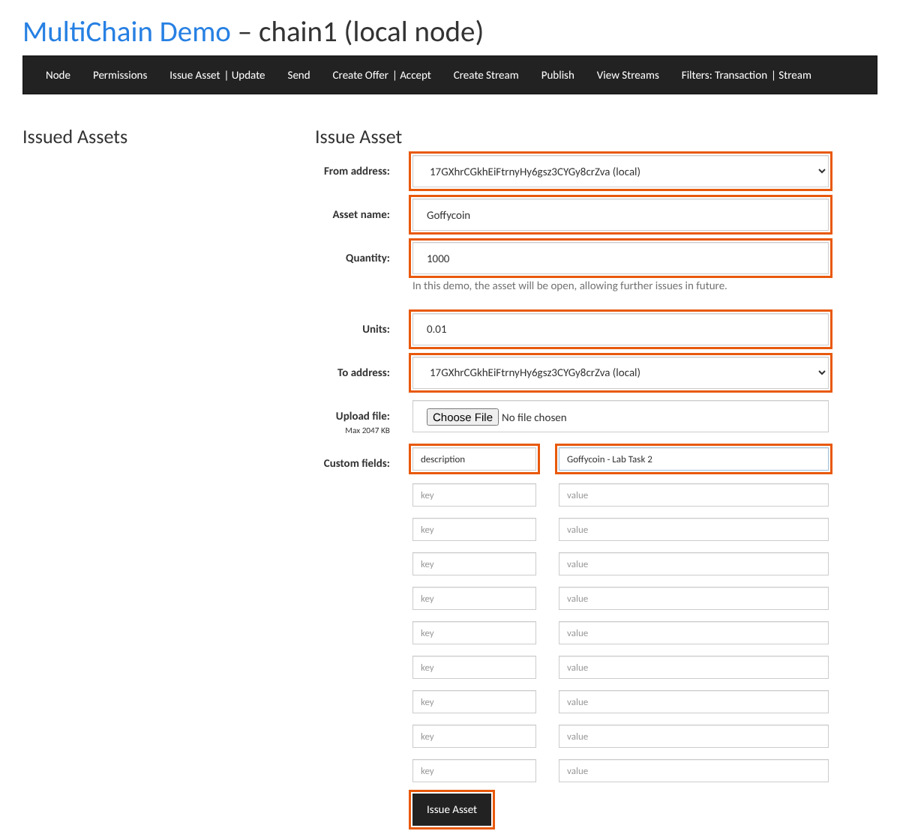
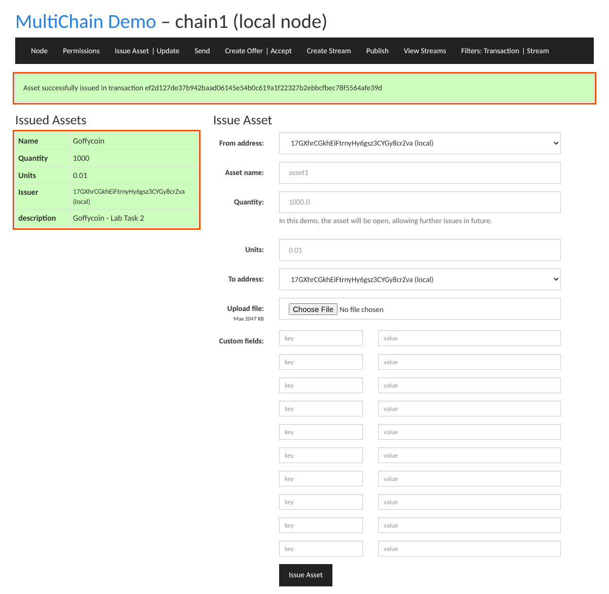
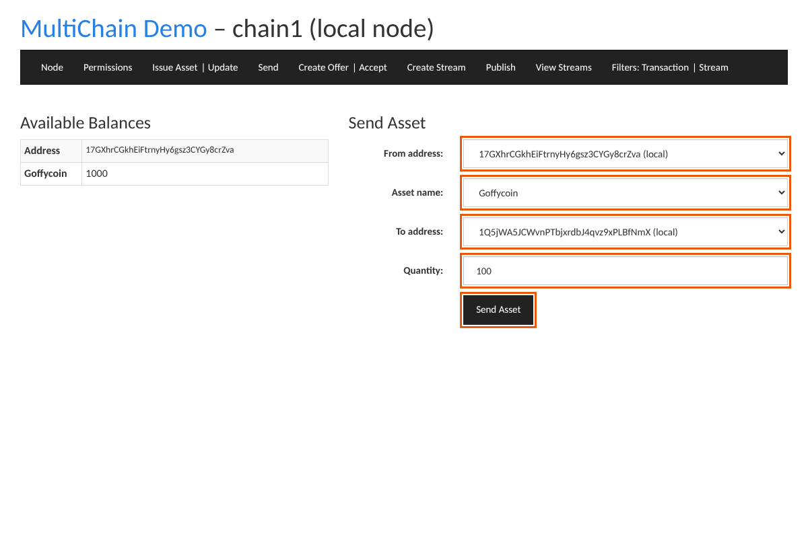
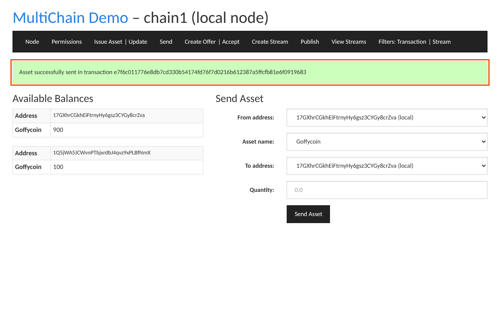
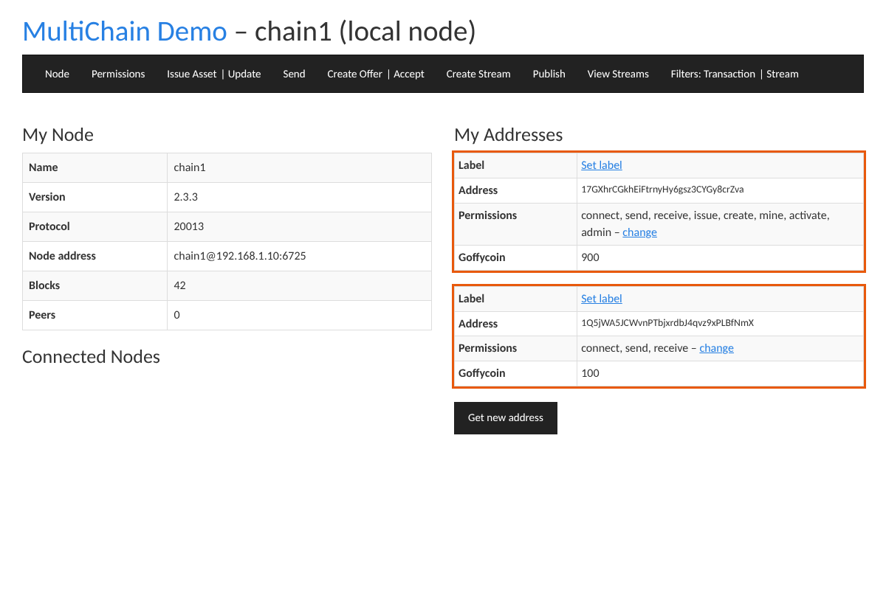

# Task 2: Create the Goffycoin asset in the Web Demo and send it to another address

> **Task 2:** Create the **Goffycoin** asset in the multichain-web-demo interface and send the asset to
> another address.

**Before you start (Task 1 done):** the node is running (`multichaind chain1`) and the Web Demo is open
at http://127.0.0.1:8080/. If not, see [05-web-demo.md](05-web-demo.md) or run
`scripts\windows\02-start-node.bat` and then `scripts\windows\05-web-demo.bat`.

## The plan

| # | Page | Action | Why |
|---|---|---|---|
| 1 | Node | **Get new address** | Creates the "other address" that will receive Goffycoin |
| 2 | Permissions | Grant **connect, send, receive** to the new address | A new address has **no permissions**. Without `receive` it won't appear in the *To address* list |
| 3 | Issue Asset | Issue **Goffycoin** (quantity 1000, units 0.01) to the admin address | Creates the asset on the blockchain |
| 4 | Send | Send **100 Goffycoin** from admin to the new address | The transfer |
| 5 | Node | Check balances: admin **900**, new address **100** | Proof it worked |

> The screenshots below come from the web demo in this repo, running against a simulated node.
> **Your addresses, transaction IDs and block count will be different.** The fields and buttons are the
> same.

---

## Step 1: Create the other address (Node page)

Open http://127.0.0.1:8080/ and click your chain.



The **Node** page lists *My Addresses*. On a new chain there is one address: the **admin** address,
which created the genesis block and has every permission. Click **Get new address**.



A second address appears (highlighted green) with **Permissions: none**. This is the address you will
send Goffycoin to. Click its **change** link.



## Step 2: Give the new address permissions (Permissions page)

The **change** link opens the Permissions page with **For address** already filled in.

- **Admin address:** your admin address (only choice)
- **For address:** the new address (already filled in)
- **Operation:** Grant
- **Permissions:** tick **Connect**, **Send**, **Receive**
- Click **Change Permissions**



You get *"Permissions successfully changed in transaction …"*. Permission changes are blockchain
transactions too.



> `receive` is the one Task 2 needs: the Send page only lists addresses that may receive assets.
> `send` lets the new address send Goffycoin back (useful if the examiner asks).

## Step 3: Create the Goffycoin asset (Issue Asset page)

Click **Issue Asset** in the menu and fill in:

| Field | Value | Meaning |
|---|---|---|
| From address | admin address | Must have the **issue** permission (only the admin does) |
| Asset name | `Goffycoin` | Unique name of the asset (use the exact spelling on your exam paper) |
| Quantity | `1000` | How many units to create |
| Units | `0.01` | Smallest divisible amount: 2 decimal places, so 1000 Goffycoin = 100000 raw units. Use `1` for whole coins only |
| To address | admin address | Who receives the 1000 new coins |
| Custom fields (optional) | `description` = `Goffycoin - Lab Task 2` | Extra metadata stored with the asset on the chain |

Click **Issue Asset**.



Result: *"Asset successfully issued in transaction …"*, and **Goffycoin** appears under *Issued Assets*
with quantity 1000, units 0.01, the issuer and your custom field. The demo always creates the asset as
**open**, so more can be issued later from the **Update** page.



**Write down the transaction ID.** It is the proof the asset was created on the blockchain.

## Step 4: Send Goffycoin to the other address (Send page)

Click **Send** in the menu. *Available Balances* on the left shows the admin holding 1000 Goffycoin.

| Field | Value |
|---|---|
| From address | admin address (it holds the Goffycoin) |
| Asset name | `Goffycoin` |
| To address | **the new address** (from Step 1) |
| Quantity | `100` |

Click **Send Asset**.



Result: *"Asset successfully sent in transaction …"*. Note this transaction ID too.



## Step 5: Show the result (Node page)

Click **Node**. Each address now shows its Goffycoin balance:

- admin address: **Goffycoin 900**
- new address: **Goffycoin 100**



**Task 2 is complete.** Take a screenshot of this page for your answer.

---

## Verify from Command Prompt (shows the examiner it's really on the blockchain)

Second Command Prompt, in the MultiChain folder. Replace `NEW_ADDRESS` and `TXID` with your values:

```bat
multichain-cli chain1 listassets Goffycoin
multichain-cli chain1 gettotalbalances
multichain-cli chain1 getaddressbalances NEW_ADDRESS
multichain-cli chain1 getrawtransaction TXID 1
multichain-cli chain1 subscribe Goffycoin
multichain-cli chain1 listassettransactions Goffycoin
```

| Command | Shows |
|---|---|
| `listassets Goffycoin` | `"name" : "Goffycoin"`, `"issueqty" : 1000`, `"units" : 0.01`, `"open" : true`, `"issuetxid"`, `"assetref"` (block-offset-txid prefix, e.g. `45-266-12345`), `"details" : {"description": ...}` |
| `gettotalbalances` | Goffycoin **1000** in total in this node's wallet (900 + 100, both addresses are local) |
| `getaddressbalances NEW_ADDRESS` | `"name" : "Goffycoin", "qty" : 100` |
| `getrawtransaction TXID 1` | The send transaction decoded: one output with **100 Goffycoin to the new address**, one with **900 back to admin** (change). Use the TXID from Step 4 |
| `listassettransactions Goffycoin` | Issue and send history (needs `subscribe Goffycoin` first) |

## Same task with commands only (backup if the web page fails)

```bat
multichain-cli chain1 getaddresses
multichain-cli chain1 getnewaddress
multichain-cli chain1 grant NEW_ADDRESS connect,send,receive
multichain-cli chain1 issue ADMIN_ADDRESS "{\"name\":\"Goffycoin\",\"open\":true}" 1000 0.01 0 "{\"description\":\"Goffycoin - Lab Task 2\"}"
multichain-cli chain1 sendasset NEW_ADDRESS Goffycoin 100
multichain-cli chain1 getaddressbalances NEW_ADDRESS
```

What the web pages call behind the scenes: **Permissions** → `grantfrom`, **Issue Asset** →
`createrawsendfrom` (with an asset-creation record), **Send** → `sendassetfrom`, **Node** balances →
`getmultibalances`.

---

## If something goes wrong

| Problem | Fix |
|---|---|
| New address is **not in the *To address* list** on Send/Issue | It has no `receive` permission. Do Step 2, then reload the page |
| **From address list is empty** on Issue Asset | Only addresses with `issue` can issue. Use the admin address |
| **Send page has no From address / Asset** | No address holds any asset yet. Do Step 3 first. The Send page only lists addresses that have a balance and the `send` permission |
| `Entity with this name already exists` | Goffycoin was already created (maybe while practising). It still counts: go to Step 4. Or use another name / reset the chain (`99-reset-chain.bat`) |
| `Insufficient funds` right after issuing | Wait ~15 s for the next block, reload the Send page and try again |
| `HTTP 0` / `HTTP 401` errors | Node stopped or `config.txt` is wrong. See [05-web-demo.md](05-web-demo.md#troubleshooting) |
| Sending to a **classmate's** address (their node joined your chain) | Their address must have `receive` on your chain (grant it on the Permissions page by pasting their address in **For address**). Then it appears in *To address* |

---

## Viva: explain what you did

- **Asset:** a token issued natively on MultiChain. Goffycoin is recorded on the blockchain with its
  name, issuer, quantity, units and custom fields. No smart contract is needed.
- **Issuing:** only addresses with the **issue** permission can create assets. The admin got every
  permission in the genesis block.
- **Units = 0.01:** Goffycoin can be split into hundredths. Internally MultiChain stores whole raw
  units (1000 × 100 = 100000).
- **Open asset:** more Goffycoin can be issued later (`issuemore`, or the **Update** page). A closed
  asset has a fixed supply.
- **Why grant permissions first:** MultiChain is **permissioned**. `anyone-can-receive = false`, so an
  address must be granted `receive` before it can hold assets.
- **Sending:** a signed transaction moves 100 Goffycoin from the admin's output to the new address. The
  admin keeps 900 as change. The total supply stays 1000.
- **Proof:** each step (grant, issue, send) has a **transaction ID**, is mined into a block (about
  every 15 s) and can be checked with `multichain-cli`.
- **The name "Goffycoin":** it sounds like *GoofyCoin*, the textbook example cryptocurrency in which
  Goofy creates new coins and owners transfer them by signing, but nothing stops double spending.
  MultiChain does what GoofyCoin cannot: the blockchain and its consensus record every transfer once,
  so the same coins cannot be spent twice.
